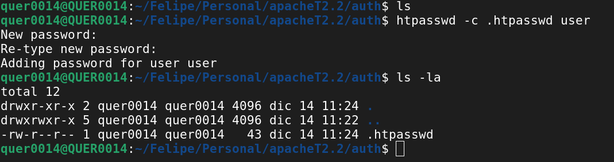
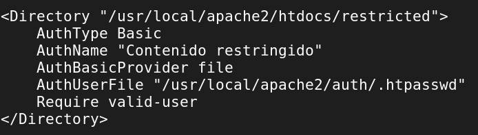
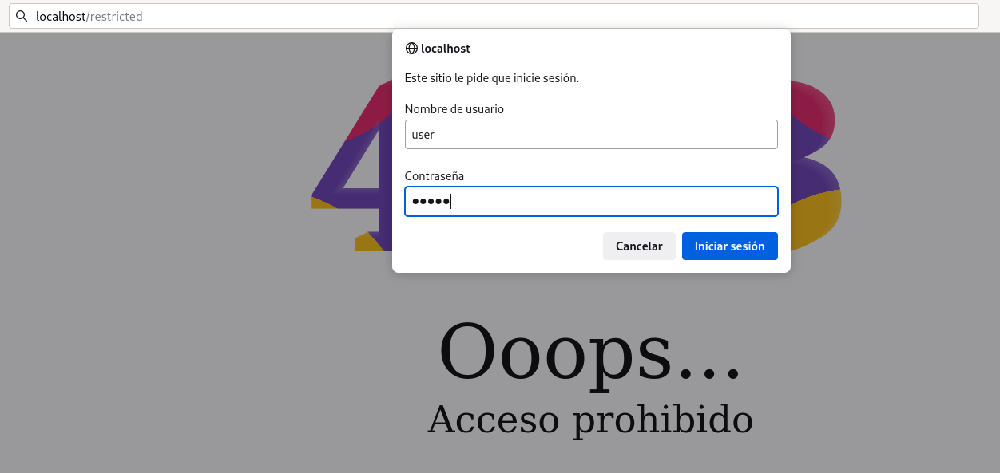
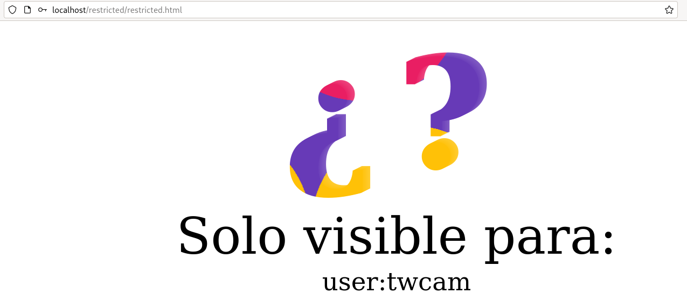

# Autenticación básica en servidores web

## Creación de la contraseña

Usuario: user \
Contraseña: twcam



## Configuración del httpd.conf



## Ejecución del servidor
``` {.cmd-output}
docker run --rm -dit --name apache -p 127.0.0.1:80:80 \
-v $HOME/apacheT2.2/httpd.conf:/usr/local/apache2/conf/httpd.conf \
-v $HOME/apacheT2.2/htdocs:/usr/local/apache2/htdocs \
-v $HOME/apacheT2.2/auth/.htpasswd:/usr/local/apache2/auth/.htpasswd \
httpd:alpine
```
## Accediendo a la URL



## Accediendo a al recurso html

